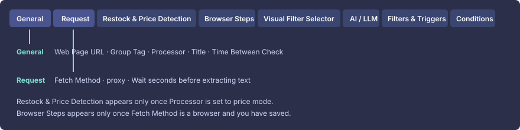
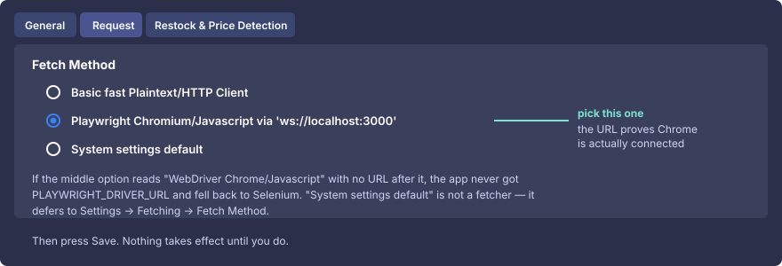
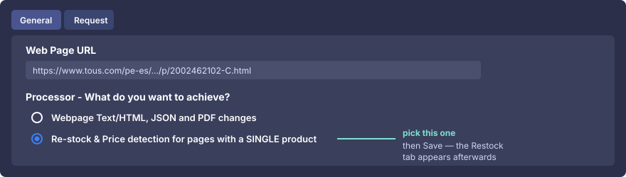
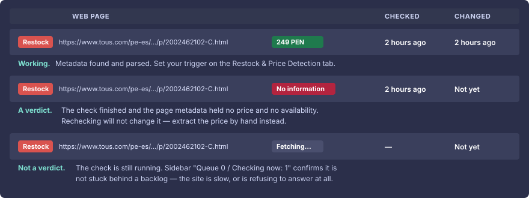

# Step-by-step: tracking a TOUS price

Click-by-click, from nothing to an alert when a bag gets cheaper. Every label
below is quoted exactly as the application shows it.

> The technique in general is in [PRICE-TRACKING.md](PRICE-TRACKING.md).
> Amazon is in [GUIDE-AMAZON.md](GUIDE-AMAZON.md). This file is only TOUS.

### Where each setting lives on the Edit screen

The edit screen is tabbed, and the two tabs you need are not the same one:

| Tab | Holds |
| --- | --- |
| **General** | Web Page URL, Group Tag, **Processor**, Title, **Time Between Check** |
| **Request** | **Fetch Method**, proxy, wait time |
| **Restock & Price Detection** | appears only after Processor is set to price mode |
| **Visual Filter Selector** | click an element on the rendered page to filter on it |

A setting you cannot find is almost always on the other tab.



> The figures in this guide are drawn from a real session on this build
> (`v0.60.3`) — same labels, same order, same wording. They are diagrams, not
> captured screenshots, so they stay readable in both GitHub themes and can be
> diffed when the UI moves.

---

## Step 0 — Prove Chrome is actually connected

TOUS builds its product pages with JavaScript. Without a browser the price is not
merely wrong, it is **absent**. Do this before anything else.

```powershell
.\contrib\podman\run.ps1 -WithBrowser
```

Then run all three of these and compare against the expected column:

```powershell
podman ps --pod --format "{{.Names}}  {{.Status}}"
podman exec changedetection sh -c 'echo $PLAYWRIGHT_DRIVER_URL'
podman exec changedetection python -c "import socket; socket.create_connection(('localhost',3000),5); print('browser reachable')"
```

| Command | Must print |
| --- | --- |
| 1 | `changedetection` **and** `browser-sockpuppet-chrome`, both `Up` |
| 2 | `ws://localhost:3000` |
| 3 | `browser reachable` |

**If any of the three is wrong, stop here** — nothing below will work. Send me
the output.

## Step 1 — Find the product URL

Open <https://www.tous.com/pe-es/carteras/bandoleras/c/486> in your own browser
and **click into the specific bag you want**.

Copy that URL — the one with the product name in it. It will look roughly like
`https://www.tous.com/pe-es/.../p/XXXXXXXXX`.

**Do not use the `/c/486` URL.** That is a category listing. It changes when any
bag on it sells out, when the grid reorders, when a badge appears — you would get
alerts constantly and none of them would be about your price.

## Step 2 — Add the watch

1. Open <http://localhost:5000>.
2. Paste the **product** URL into the **URL** box at the top.
3. Click **Watch**.

The watch appears in the list. Ignore whatever it says for now.

## Step 3 — Point this watch at Chrome ← the step people miss

1. Click the watch's **Edit** (pencil) icon.
2. Click the **Request** tab. **Fetch Method** is there, not on **General**.
   (The *use the Chrome/WebDriver Fetcher* link under the URL box is not a
   shortcut to it — it opens the upstream wiki in a new page.)
3. Under **Fetch Method** there are **three** radios. Select the middle one:

   | Option | Take it? |
   | --- | --- |
   | `Basic fast Plaintext/HTTP Client` | no — this is raw HTTP, and TOUS's raw HTML has no price in it |
   | `Playwright Chromium/Javascript via 'ws://localhost:3000'` | **yes** |
   | `System settings default` | only if you would rather every watch follow **Settings → Fetching** |

   

   If the middle option reads **WebDriver Chrome/Javascript** with no URL after
   it, the app never received the driver URL — go back to Step 0.

   `System settings default` is not a fourth fetcher. It stores the value
   `system` and defers to the global setting at fetch time, so it is the right
   pick when you want one place to change them all — and the wrong pick if you
   want this bag pinned to Chrome whatever the global default becomes later.

4. Click **Save**.

A watch keeps whatever fetcher was the default **at the moment it was created**,
and never changes on its own afterwards. `run.ps1 -WithBrowser` sets that default,
so a watch you add *after* starting with `-WithBrowser` on a fresh datastore
already has the Playwright option selected — open the tab and confirm rather than
assume. Watches added before that, or on an install whose saved default is the
basic fetcher, are still fetching raw HTML — and TOUS's raw HTML has no price in
it.

To avoid repeating this for every bag: **Settings → Fetching → Fetch Method** →
select the same Playwright option → **Save**. New watches then inherit it.

## Step 4 — Switch it to price mode

1. **Edit** the watch again.
2. On the **General** tab find **Processor** and select:

   > **Re-stock & Price detection for pages with a SINGLE product**

3. Click **Save**.

   

A new **Restock & Price Detection** tab now exists on the edit screen.

> **Shortcut:** if the app noticed product data by itself, the watch row shows
> *"Switch to Restock & Price watch mode?"* with a **Yes** button. That does this
> step for you.

## Step 5 — Confirm it can actually read the price

1. Back on the watch list, click **Recheck** on that watch.
2. Wait for it to finish, then look at the row.

The row itself tells you which of three things happened — and they are not
degrees of the same failure, they have different fixes:



| The row shows | Meaning | Go to |
| --- | --- | --- |
| A price, e.g. `249 PEN` | Working | Step 6 |
| Red **`No information`** | The check finished; the page metadata had no price and no availability | [When no price appears](#when-no-price-appears) |
| **`Fetching…`** that never resolves | The check is still running — TOUS is not answering | [When the row never leaves "Fetching…"](#when-the-row-never-leaves-fetching) |

**`No information` is a finished answer, not a "not yet".** Rechecking it a
tenth time cannot help. The price mode never reads the price you can see on the
page — it parses `<script type="application/ld+json">`, microdata `itemprop`
attributes and OpenGraph `product:price:amount`. If TOUS does not publish the
price there, no fetcher setting will conjure it, and the manual route is the
answer.

## Step 6 — Set your trigger

**Edit** the watch → **Restock & Price Detection** tab:

| Field | Set it to | Why |
| --- | --- | --- |
| **Follow price changes** | ticked | otherwise only stock changes count as a change at all |
| **Below price to trigger notification** | your target, e.g. `249` | this is the "tell me when it gets cheap" trigger |
| **Above price to trigger notification** | leave blank | only if you also want to hear about rises |
| **Threshold (%) for price changes since the previous check** | `2` | ignores cent-level jitter and rounding noise |
| **Re-stock detection** | **In Stock only (Out Of Stock -> In Stock only)** | stops alerts for a sold-out item whose price "changed" to nothing |

**Save.**

## Step 7 — Make the alert say which way it moved

**Edit** → **Notifications**, and use this as the body:

```
{{watch_title}}

Now:    {{restock.price}}
Before: {{restock.previous_price}}
Stock:  {{restock.in_stock}}

{{watch_url}}
```

Set it once globally under **Settings → Notifications** and every price watch
inherits it.

## Step 8 — Set a sane interval

**Edit** → **General** → **Time between check**: **6 hours** is right for retail.

Checking every few minutes does not find the drop meaningfully sooner, and it is
the most reliable way to get your IP blocked.

## Step 9 — Repeat per bag

One watch per bag. Each gets its own target price, and each alert names the actual
item. This beats one category watch in every respect.

---

## When no price appears

TOUS does not always publish machine-readable product data. Extract the price by
hand:

1. **Edit** the watch → **Visual Filter Selector** tab.
   - If it says *"Sorry, this functionality only works with fetchers that support
     Javascript and screenshots"*, you skipped Step 3.
   - It may need one **Recheck** first to have a screenshot to show you.
2. **Click the price** on the rendered page. That fills in a filter in
   **Filters & Triggers**.
3. Open **Filters & Triggers** and check the filter caught *only* the price —
   `S/ 249.00`, not the whole product block.
4. Go to the **Conditions** tab and add one rule:

   > **Extracted number after 'Filters & Triggers'** — **less than** — `249`

5. **Save**, then **Recheck**.

This is the manual equivalent of Step 6: it fires only when the number is below
your target.

## When the row never leaves "Fetching…"

This is not the same problem as a missing price, and the fixes do not overlap.
`Fetching…` means the check is *running*. Work out what it is waiting on.

**1. Rule out a backlog.** Look at the left sidebar. `Queue 0` with
`Checking now: 1` means nothing is stuck in a queue — this watch is being
fetched right now, and the wait is the site's, not the app's.

**2. Ask whether TOUS is answering at all.** Run this from the machine, outside
the app entirely:

```powershell
curl.exe -sS -m 30 -o NUL -w "%{http_code} in %{time_total}s`n" `
  -A "Mozilla/5.0 (Windows NT 10.0; Win64; x64) AppleWebKit/537.36 (KHTML, like Gecko) Chrome/152.0.0.0 Safari/537.36" `
  "https://www.tous.com/pe-es/bandolera-pequena-beige-kaos-icon/p/2002462102-C.html"
```

| What comes back | What it means |
| --- | --- |
| `200 in 0.8s` | The site is fine. The problem is inside the app → step 3 |
| `000` after the full 30s, or `Connection was reset` | **TOUS is refusing to answer this client.** No status code, no CAPTCHA page — just silence |

The second outcome is a deliberate anti-bot measure and is more hostile than a
`403`, because there is no error for the app to report: the fetch simply runs
until it times out, which is exactly what a hung row looks like. It is worth
knowing that this can depend on where the request comes from — a residential
connection may be served normally while a datacenter or VPN address is not, so
the same watch can behave differently on two machines.

**3. Read the app's own account of the check.**

```powershell
.\contrib\podman\logs.ps1 -Tail 80        # the app
.\contrib\podman\logs.ps1 -Browser -Tail 80   # Chrome itself
```

A `Timeout` / `net::ERR_TIMED_OUT` for the TOUS URL confirms the diagnosis from
step 2. Renderer crashes or "Target closed" instead mean Chrome ran out of
`/dev/shm` — a different fault, covered in
[PRICE-TRACKING.md](PRICE-TRACKING.md) section 7.

**4. If the site simply will not answer**, give the fetch more room before
concluding anything: **Edit → Request → Wait seconds before extracting text**,
try `10`. A heavy JS storefront on a slow connection can genuinely need it. If
it still times out after that, TOUS is not watchable from this machine, and no
setting in this application changes that.

## TOUS-specific notes

- **Currency.** Peruvian soles (`S/`). If a price is detected but looks 100x or
  1/100 off, the decimal separator was misread — tighten the filter in
  Filters & Triggers to the exact price element.
- **"Was" prices.** Discounted items show the old price struck through. If your
  filter grabbed that one you will track the wrong number. Check the preview text.
- **The cart page** (`/pe-es/cart`) needs you to be logged in and is the weakest
  option — see [PRICE-TRACKING.md](PRICE-TRACKING.md) section 8 before using it.
  Per-bag watches are the real mechanism.

## If it still does not work

| What you see | What it means |
| --- | --- |
| No **Request** tab at all | This watch's processor has no request settings — re-add the watch |
| No **Playwright** option in Fetch Method | The app has no driver URL → Step 0 |
| Fetch Method is Playwright, row says **`No information`** | The metadata has no price → *When no price appears*. Rechecking will not help |
| Row sits on **`Fetching…`** and never finishes | The site is not answering → *When the row never leaves "Fetching…"* |
| Only two options under Fetch Method | You are looking at **Settings → Fetching**, not the watch. The global setting lists just the real fetchers; a watch adds "System settings default" on top, because a watch can defer to the global one and the global one has nothing to defer to |
| Watch stuck on "Checking" | Chrome is wedged: `.\contrib\podman\logs.ps1 -Browser` |
| Preview shows a bare or unstyled page | Still on the basic fetcher — Step 3 was not saved |
| Alerts on every check, price unchanged | Threshold is 0 → set `2` in Step 6 |
| `403` / `503` / a CAPTCHA page | Interval too short → Step 8 |
